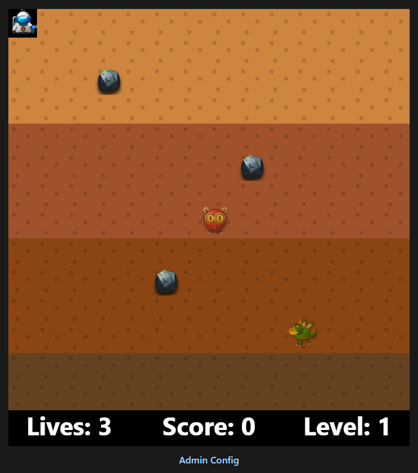

# Dig Dug Clone

Welcome to my browser-based clone of the classic arcade game, Dig Dug!

This project is a tribute to the Namco game, created entirely with vanilla JavaScript, HTML, and CSS.

AI (Gemini 2.5) was used to generate the image files, and for taking one big script and splitting it into separate logical modules.

## Screenshot

## How to Play

The goal of the game is to eliminate all the enemies on the screen. You can do this in two ways:
1.  **Pump them up!** Use your harpoon to latch onto an enemy and pump them full of air until they pop.
2.  **Drop a rock on them!** Lure an enemy under a rock and dig the dirt out from under it to crush them.

Be careful, though! The enemies can turn into ghosts and travel through the dirt to get you. Don't forget: Fygars can breathe fire.

At the start of each level, a `Level X` intro card is shown for 5 seconds, then fades out before gameplay begins.

## Controls

-   **Arrow Keys:** Move up, down, left, and right.
-   **Spacebar:** Shoot your harpoon and pump up enemies.
-   **P:** Pause/resume gameplay.
-   **X:** Toggle monster freeze cheat.
-   **J:** Debug shortcut to jump directly to Level 10.

Have fun!

## Run Locally (or on a server)

1. Start the server:
	`node server.js`
2. Open `http://localhost:8080/` for local play
   or `http://server-ip-address:8080/` in your browser.

## Game Config

- Open `http://server-ip-address:8080/config.html` (or use the `Admin Config` link under the Play button).
- Save changes to gameplay settings from the form.
- Changes are applied automatically on the next level start or next new game.

## Things To Do
 - Add sound effects
 - Create intro scene
 - Server-side High Score list
 - Better level and death visuals
 

## License

[MIT](LICENSE)
